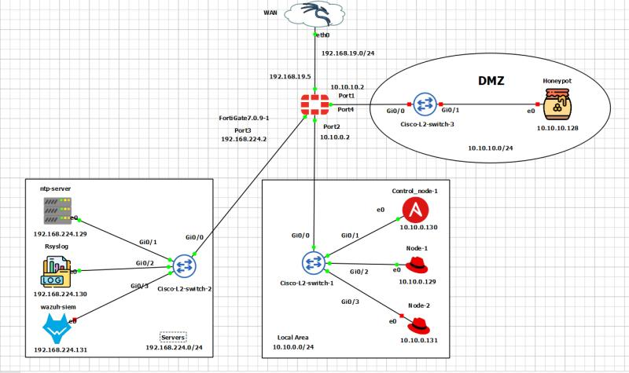
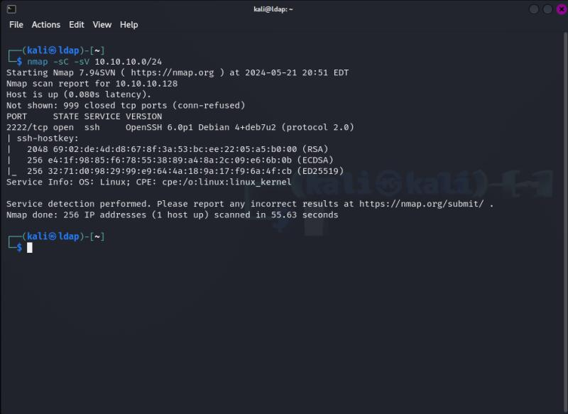
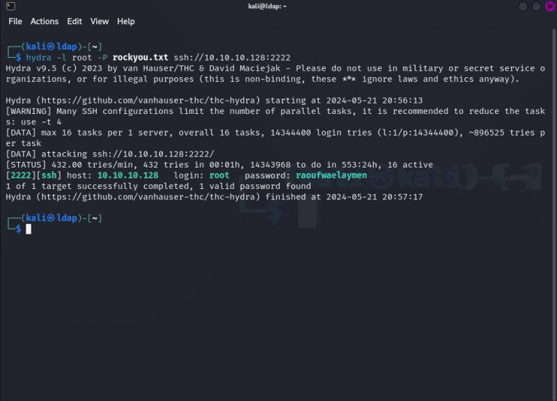
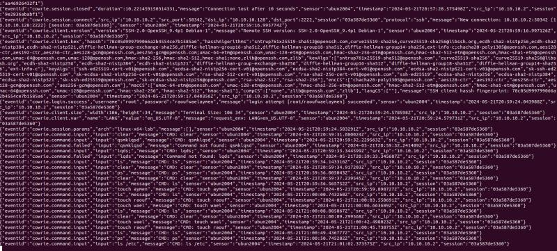
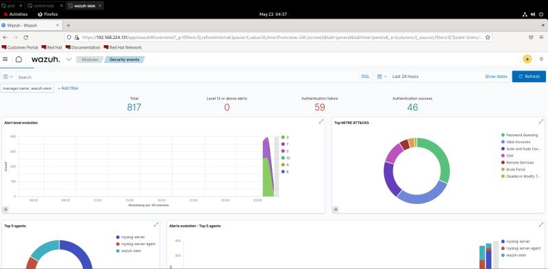
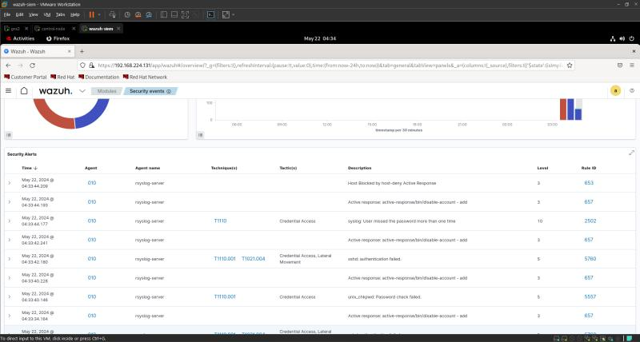
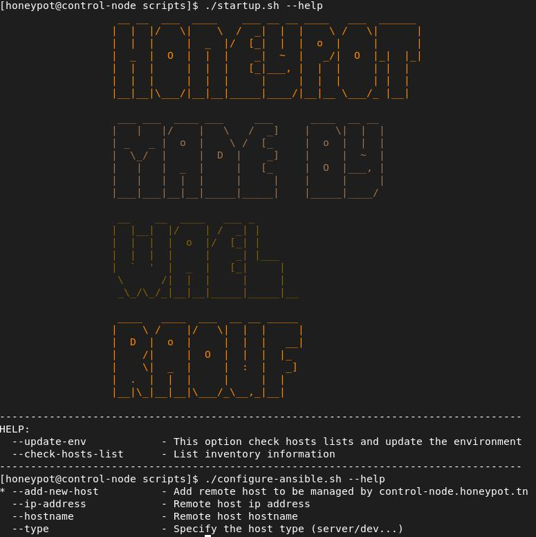
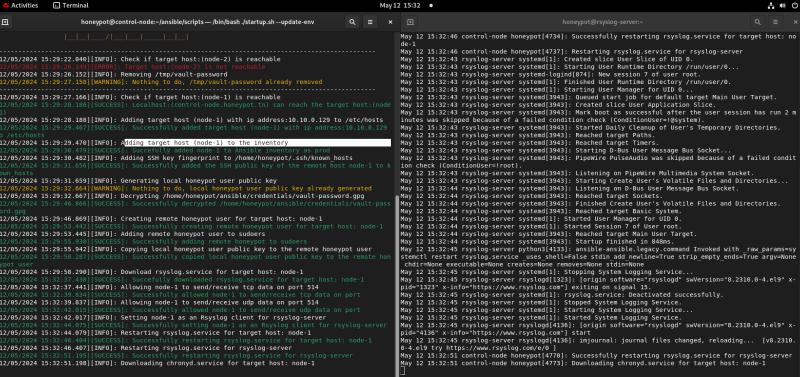

# NetworkDefenseSuite

The primary objective of this project was to design and implement a robust security architecture for a simulated enterprise network, capable of detecting, analyzing, and effectively responding to cyber threats. By utilizing advanced technologies such as FortiGate Firewall, Cowrie Honeypot, and Wazuh SIEM, the project aimed to establish a defense-in-depth strategy, thereby minimizing security risks and enhancing the network's resilience against attacks. Special attention was given to the system's ability to automatically redirect suspicious traffic to a honeypot for further analysis, while maintaining operational continuity for legitimate users. By simulating a real attack using Kali Linux, we aimed to evaluate the effectiveness of our architecture under real-world conditions, to better understand the strengths and limitations of our solution.

  

### 1. FortiGate Firewall Configuration:
- **Port 1** is connected to the WAN interface with an IP address of `192.168.19.5`.
- **Port 2** is connected to Subnet 2 with an IP address of `192.168.224.2/24`, which includes key servers:
  - **NTP server** at `192.168.224.129` (To sync the time)
  - **Rsyslog server** at `192.168.224.130` (Collects logs from all nodes and sends them to Wazuh SIEM through a Wazuh agent already implemented in the rsyslog server)

  **NOTICE:** Instead of installing a Wazuh agent on each node, we have configured all nodes to operate as rsyslog clients for the rsyslog server. Consequently, only one Wazuh agent is required to transmit logs from the rsyslog server to Wazuh SIEM, encompassing logs from all nodes.
  - **Wazuh SIEM** at `192.168.224.30` (Threat detection and auto-response)

### 2. Network Subnets:
- **Subnet 1:** `10.10.0.0/24` with nodes including:
  - **Control-node-1** at `10.10.0.130`
  
  **NOTICE:** We've developed a well-structured shell script with Ansible to enable the control node to automate the addition of any new host or list of hosts to be managed by Ansible. It configures them as both rsyslog and NTP clients for their respective servers, eliminating the need for manual setup on each host.
  - **Node-1** at `10.10.0.129` (For test purposes)
  - **Node-2** at `10.10.0.131` (For test purposes)
- **Subnet 2:** `192.168.224.0/24`, detailed above.
- **DMZ (Demilitarized Zone):** `10.10.10.0/24` hosting a honeypot (vulnerable VM) at `10.10.10.128`.

### 3. Connectivity:
- A **Cisco switch** (Cisco L2 switch) facilitates connections between nodes in Subnet 1 and the DMZ.

### 4. Honeypot Deployment: (Cowrie)
- Located in the DMZ to isolate and monitor potentially malicious traffic, helping to safeguard the internal network by detecting brute force attacks without exposing actual network services.

**REFERENCE:** [Cowrie on GitHub](https://github.com/cowrie/cowrie)

---

## Detailed Scenarios

### Wazuh Installation and Configuration
Wazuh is installed to provide comprehensive security monitoring and log analysis. Here's how it was set up:
1. **Assisted Installation**:
   - Wazuh components (manager, agent, and API) were installed following the official documentation.
     
     **REFERENCE:** [Wazuh documentation](https://documentation.wazuh.com/current/quickstart.html)
     
   - Download and run the Wazuh installation assistant.
    
    ```bash
    curl -sO https://packages.wazuh.com/4.7/wazuh-install.sh && sudo bash ./wazuh-install.sh -a
    ```
    
    Once the assistant finishes the installation, the output shows the access credentials and a message that confirms that the installation was successful.
    
    ```
    INFO: --- Summary ---
    INFO: You can access the web interface https://<wazuh-dashboard-ip>
        User: admin
        Password: <ADMIN_PASSWORD>
    INFO: Installation finished.
    ``` 
    
    You now have installed and configured Wazuh.
    
    Access the Wazuh web interface with `https://<wazuh-dashboard-ip>` and your credentials:
    
    - **Username:** admin
    - **Password:** <ADMIN_PASSWORD>
    
    When you access the Wazuh dashboard for the first time, the browser shows a warning message stating that the certificate was not issued by a trusted authority. This is expected and the user has the option to accept the certificate as an exception or, alternatively, configure the system to use a certificate from a trusted authority.
    
    **Note:** You can find the passwords for all the Wazuh indexer and Wazuh API users in the `wazuh-passwords.txt` file inside `wazuh-install-files.tar`. To print them, run the following command:
    
    ```bash
    sudo tar -O -xvf wazuh-install-files.tar wazuh-install-files/wazuh-passwords.txt
    ```

2. **Configuration**:
   - Agents were installed on critical nodes (only rsyslog-server).
   - The Rsyslog server was set up to forward logs to Wazuh.
   - Alerts and response policies were defined within the Wazuh manager.

### Rsyslog Server Setup
Rsyslog was configured to centralize log management, making it easier to monitor and analyze events.
1. **Installation**:
   - Installed Rsyslog on the server designated for log collection.
   - Configured the Rsyslog server to accept logs from all network nodes.

2. **Configuration**:
   - Nodes were configured as Rsyslog clients.
   - Logs from the clients were directed to the Rsyslog server.
   - The server was set up to forward logs to the Wazuh SIEM.

### NTP Server Setup
The NTP server ensures all devices in the network have synchronized time, which is crucial for accurate log correlation.
1. **Installation**:
   - Installed the NTP service on a designated server.

2. **Configuration**:
   - The NTP server was configured to sync with reliable external time sources.
   - All network devices were set up as NTP clients to sync their time with the NTP server.

### Scenario: Brute Force Attack
1. **Active information gathering**
   - After conducting active information gathering, we successfully scanned the 10.10.10.0/24 network and identified a vulnerable host, our honeypot (10.10.10.128), with an open SSH port 2222.
     
     
     
1. **Attack Execution**:
   - A brute force attack was simulated using Hydra against the SSH service on the honeypot.
     
     
     
3. **Detection**:
   - Cowrie detected the brute force attempts and logged the events.
   - Rsyslog forwarded the logs to Wazuh.
   - Wazuh generated alerts based on the predefined rules.

  
  
  

### Automation Script
The automation script developed for this project simplifies the management and configuration of network nodes.

  
  
1. **Key Functionalities**:
   - **Argument Handling**: The script uses command-line arguments to specify actions like adding a new host, setting IP addresses, hostnames, and host types. It validates these inputs and provides a help menu for usage guidance.
   - **Host Verification**: Checks if the specified IP address is reachable and validates it against a standard IP address pattern. Logs informational, error, or success messages based on the outcome of the reachability test.
   - **Host Addition to `/etc/hosts`**: Attempts to add the host to the `/etc/hosts` file if it's not already listed. Logs the actions performed during this operation.
   - **Host Addition to Ansible Inventory**: Adds the host to an Ansible inventory file under specific groups based on the host type (like server, prod, or dev). Handles errors if the host is already present or if there are issues with the inventory file.
   - **SSH Configuration**: Manages SSH keys by checking for existing entries in `known_hosts` and adding new keys if necessary. Generates a public key for the Ansible user if it doesn’t exist.
   - **Security Configurations**: Decrypts credentials stored in a vault using GPG. Creates a user on the remote host with Ansible and adds this user to the sudoers file without requiring a password for elevated privileges. Copies the generated public key to the remote host to facilitate password-less SSH access.
   - **Rsyslog Client Configuration**: Installs and configures the rsyslog service if it is not already installed. Adjusts firewall settings to allow traffic for rsyslog on specified ports. Sets the remote host as a client to a centralized rsyslog server and restarts the rsyslog service to apply configurations.
   - **NTP Client Configuration**: Similar to rsyslog, it checks for and installs the NTP service if necessary. Configures the remote host as an NTP client to sync time with a specified NTP server. Ensures the NTP service starts at boot and restarts it to apply new configurations.

2. **Log Handling**:
   - The script includes detailed log handling where it records every action taken, along with timestamps, into a dedicated log file. It uses different colors to signify the type of log message (info, warning, success, error).
   - It employs functions like `LOG_INFO`, `LOG_SUCCESS`, `LOG_WARNING`, and `LOG_ERROR` to streamline logging and display outputs.

3. **Error Management and Cleanup**:
   - The script includes robust error checking and handling mechanisms that stop execution upon encountering critical errors, ensuring that any misconfiguration doesn't propagate.
   - It ensures the cleanup of sensitive data by removing the temporary vault password file after its usage.

  
